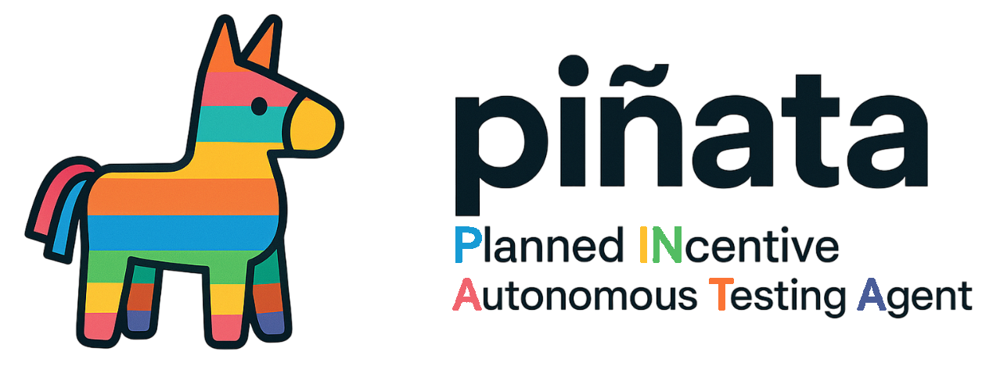
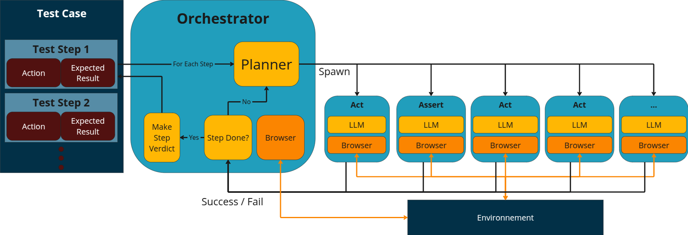

This README is modified from [pinata/README.md at main · Smartesting/pinata](https://github.com/Smartesting/pinata/blob/main/README.md)


Implementation of an LLM-powered Autonomous Testing Agent (ATA), as presented in the paper _Are Autonomous Web Agents good testers?_




# Install

First install uv, installation details [here](https://docs.astral.sh/uv/getting-started/installation/).

1. Download dependencies

```bash
uv sync
```

2. Install playwright's chromium driver

```shell
uv run playwright install chromium
```

3. Create a `.env` file in the root directory and add your API key. For example, if you use OpenAI:   

```shell
OPENAI_API_KEY="sk..."
```

# Run

Execute the _run.py_ file with the appropriate parameters:

- -f: path to JSON file containing the test case
- -p: provider for the llm service (supported: "openai", "anthropic", "google", "mistral", "openrouter", default: "openai")

Example:

```bash
uv run python run.py -f test_case.json -p google
```

The expected JSON format for a test case is as follows:

```json
{
  "name": "test case name",
  "url": "website url",
  "actions": [
    {
      "action": "action 1",
      "expectedResult": "assertion 1"
    },
    {
      "action": "action 2",
      "expectedResult": "assertion 2"
    },
  ]
}
```


